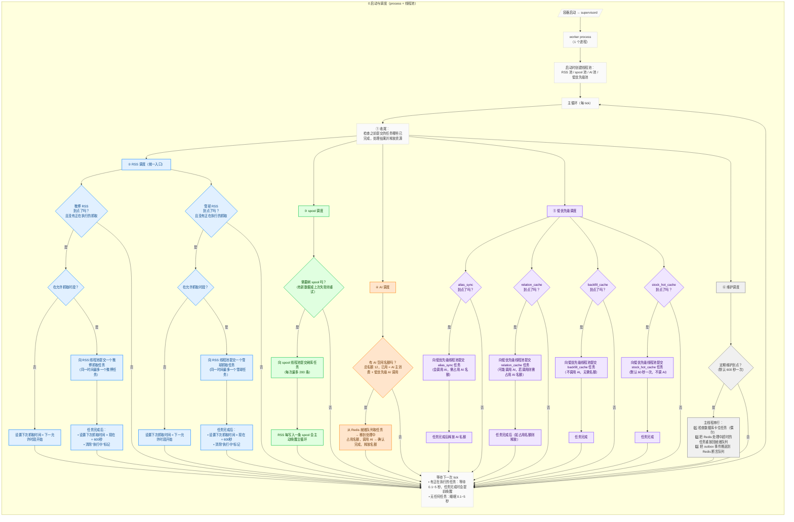

```mermaid
flowchart TD
    subgraph RUN ["0 启动与调度（process + 线程池）"]
        direction TB

        START[/"容器启动 → supervisord"/] --> WORKER["worker process<br/>（1 个进程）"]
        WORKER --> INIT["启动时创建线程池：<br/>RSS 池 / spool 池 / AI 池 / 低优先级池"]
        INIT --> LOOP["主循环（每 tick）"]

        %% 每 tick 先收尾
        LOOP --> COLLECT["① 收尾：<br/>检查之前提交的任务哪些已完成，处理结果并释放资源"]

        %% 并列调度分支
        COLLECT --> RSS_SCHED["② RSS 调度（统一入口）"]
        COLLECT --> SPOOL_SCHED["③ spool 调度"]
        COLLECT --> AI_SCHED["④ AI 调度"]
        COLLECT --> LOW_SCHED["⑤ 低优先级调度"]
        COLLECT --> MAINT_SCHED["⑥ 维护调度"]

        %% ========== RSS 调度：微博和雪球并发 ==========
        RSS_SCHED --> WEIBO_CHECK{"微博 RSS<br/>到点了吗？<br/>且没有正在执行的抓取"}
        RSS_SCHED --> XUEQIU_CHECK{"雪球 RSS<br/>到点了吗？<br/>且没有正在执行的抓取"}

        %% 微博分支
        WEIBO_CHECK -- 是 --> WEIBO_HOURS{"在允许抓取时段？"}
        WEIBO_HOURS -- 否 --> WEIBO_SET["设置下次抓取时间 = 下一允许时段开始"]
        WEIBO_SET --> WAIT
        WEIBO_HOURS -- 是 --> WEIBO_SUBMIT["向 RSS 线程池提交一个微博抓取任务<br/>（同一时间最多一个微博任务）"]
        WEIBO_SUBMIT --> WEIBO_DONE["任务完成后：<br/>• 设置下次抓取时间 = 现在 + 600秒<br/>• 清除“执行中”标记"]
        WEIBO_DONE --> WAIT

        %% 雪球分支
        XUEQIU_CHECK -- 是 --> XUEQIU_HOURS{"在允许抓取时段？"}
        XUEQIU_HOURS -- 否 --> XUEQIU_SET["设置下次抓取时间 = 下一允许时段开始"]
        XUEQIU_SET --> WAIT
        XUEQIU_HOURS -- 是 --> XUEQIU_SUBMIT["向 RSS 线程池提交一个雪球抓取任务<br/>（同一时间最多一个雪球任务）"]
        XUEQIU_SUBMIT --> XUEQIU_DONE["任务完成后：<br/>• 设置下次抓取时间 = 现在 + 600秒<br/>• 清除“执行中”标记"]
        XUEQIU_DONE --> WAIT

        WEIBO_CHECK -- 否 --> WAIT
        XUEQIU_CHECK -- 否 --> WAIT

        %% ========== spool 调度 ==========
        SPOOL_SCHED --> SPOOL_CHECK{"需要刷 spool 吗？<br/>（有新数据或上次失败待重试）"}
        SPOOL_CHECK -- 是 --> SPOOL_SUBMIT["向 spool 线程池提交刷库任务<br/>（每次最多 200 条）"]
        SPOOL_SUBMIT --> SPOOL_DONE["RSS 每写入一条 spool 会主动唤醒主循环"]
        SPOOL_DONE --> WAIT
        SPOOL_CHECK -- 否 --> WAIT

        %% ========== AI 调度（默认使用 Redis） ==========
        AI_SCHED --> AI_CAP{"有 AI 空闲名额吗？<br/>总名额 12，已用 = AI 主消费 + 低优先级 AI 调用"}
        AI_CAP -- 是 --> REDIS_AI["从 Redis 就绪队列取任务 → 移到处理中<br/>占用名额，调用 AI → 确认完成，释放名额"]
        REDIS_AI --> WAIT
        AI_CAP -- 否 --> WAIT

        %% ========== 低优先级调度（四个独立任务） ==========
        LOW_SCHED --> ALIAS_CHECK{"alias_sync<br/>到点了吗？"}
        LOW_SCHED --> RELATION_CHECK{"relation_cache<br/>到点了吗？"}
        LOW_SCHED --> BACKFILL_CHECK{"backfill_cache<br/>到点了吗？"}
        LOW_SCHED --> HOT_CHECK{"stock_hot_cache<br/>到点了吗？"}

        ALIAS_CHECK -- 是 --> ALIAS_SUBMIT["向低优先级线程池提交 alias_sync 任务<br/>（会调用 AI，需占用 AI 名额）"]
        ALIAS_SUBMIT --> ALIAS_DONE["任务完成后释放 AI 名额"]
        ALIAS_DONE --> WAIT
        ALIAS_CHECK -- 否 --> WAIT

        RELATION_CHECK -- 是 --> RELATION_SUBMIT["向低优先级线程池提交 relation_cache 任务<br/>（可能调用 AI，若调用则需占用 AI 名额）"]
        RELATION_SUBMIT --> RELATION_DONE["任务完成后（如占用名额则释放）"]
        RELATION_DONE --> WAIT
        RELATION_CHECK -- 否 --> WAIT

        BACKFILL_CHECK -- 是 --> BACKFILL_SUBMIT["向低优先级线程池提交 backfill_cache 任务<br/>（不调用 AI，无需名额）"]
        BACKFILL_SUBMIT --> BACKFILL_DONE["任务完成"]
        BACKFILL_DONE --> WAIT
        BACKFILL_CHECK -- 否 --> WAIT

        HOT_CHECK -- 是 --> HOT_SUBMIT["向低优先级线程池提交 stock_hot_cache 任务<br/>（默认 60 秒一次，不调 AI）"]
        HOT_SUBMIT --> HOT_DONE["任务完成"]
        HOT_DONE --> WAIT
        HOT_CHECK -- 否 --> WAIT

        %% ========== 维护调度 ==========
        MAINT_SCHED --> MAINT_CHECK{"定期维护到点？<br/>（默认 600 秒一次）"}
        MAINT_CHECK -- 是 --> MAINT_STEPS["主线程串行：<br/>1️⃣ 检查数据库卡住任务（偶尔）<br/>2️⃣ 把 Redis 处理中超时的任务重放回就绪队列<br/>3️⃣ 把 outbox 事件推送到 Redis 断言队列"]
        MAINT_STEPS --> WAIT
        MAINT_CHECK -- 否 --> WAIT

        %% 等待节点
        WAIT["等待下一次 tick<br/>• 有正在执行的任务：等待 0.1~5 秒，任务完成时会提前唤醒<br/>• 无任何任务：睡眠 0.1~5 秒"]
        WAIT --> LOOP
    end

    %% ========== 定义样式类 ==========
    classDef rss fill:#E1F0FF,stroke:#3399FF,stroke-width:2px,color:#004080
    classDef spool fill:#E0FFE0,stroke:#33CC66,stroke-width:2px,color:#004D00
    classDef ai fill:#FFE5CC,stroke:#FF9933,stroke-width:2px,color:#663300
    classDef low fill:#F0E6FF,stroke:#9966FF,stroke-width:2px,color:#330066
    classDef maint fill:#F0F0F0,stroke:#999999,stroke-width:2px,color:#333333
    classDef common fill:#FAFAFA,stroke:#CCCCCC,stroke-width:1px,color:#333333

    %% 应用样式到对应节点
    class RSS_SCHED,WEIBO_CHECK,WEIBO_HOURS,WEIBO_SET,WEIBO_SUBMIT,WEIBO_DONE,XUEQIU_CHECK,XUEQIU_HOURS,XUEQIU_SET,XUEQIU_SUBMIT,XUEQIU_DONE rss
    class SPOOL_SCHED,SPOOL_CHECK,SPOOL_SUBMIT,SPOOL_DONE spool
    class AI_SCHED,AI_CAP,REDIS_AI ai
    class LOW_SCHED,ALIAS_CHECK,ALIAS_SUBMIT,ALIAS_DONE,RELATION_CHECK,RELATION_SUBMIT,RELATION_DONE,BACKFILL_CHECK,BACKFILL_SUBMIT,BACKFILL_DONE,HOT_CHECK,HOT_SUBMIT,HOT_DONE low
    class MAINT_SCHED,MAINT_CHECK,MAINT_STEPS maint
    class START,WORKER,INIT,LOOP,COLLECT,WAIT common
```
