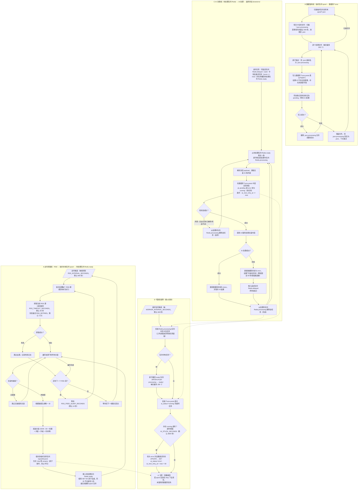

```mermaid
flowchart TD
    subgraph B ["<span style='white-space: nowrap;'>A 定时抓取线：RSS → 临时本地队列 spool → 待处理队列 Redis.ready</span>"]
        direction TB
        B_START[/"定时触发（每轮间隔 RSS_INTERVAL_SECONDS，默认 600 秒）"/]
        B_FOR_EACH["依次处理每个 RSS 源<br/>（顺序串行执行）"]
        B_FETCH["抓取当前 RSS 源<br/>（请求超时 RSS_TIMEOUT_SECONDS，默认 60 秒<br/>失败重试 RSS_RETRIES，默认 5 次）"]
        B_FETCH_FAIL{"抓取成功？"}
        B_SKIP["跳过此源，记录失败日志"]
        B_FOR_EACH_ENTRY["遍历该源下的所有文章"]
        B_GET_LINK{"文章有链接？"}
        B_SKIP_ENTRY["跳过无链接的文章"]
        B_CALC_ID["根据链接生成唯一 ID"]
        B_BUILD_PAYLOAD["组装文章 JSON（ID + 标题 + 内容 + 作者 + 时间等）"]
        B_WRITE_SPOOL["保存到临时文件队列（spool/id.json）<br/>先写 .tmp 再 rename（原子操作，防止半写）"]
        B_REDIS_PUSH["推入待处理队列 Redis.ready<br/>使用 SET NX 原子去重，同 ID 不会重复入队<br/>重复则删除 spool 文件"]
        B_NEXT_URL{"还有下一个 RSS 源？"}
        B_SLEEP_URL["等待 RSS_FEED_SLEEP_SECONDS（默认 10 秒）"]
        B_WAIT_NEXT["等待至下一轮整点启动"]
    end

    B_START --> B_FOR_EACH --> B_FETCH --> B_FETCH_FAIL
    B_FETCH_FAIL -- 失败 --> B_SKIP --> B_NEXT_URL
    B_FETCH_FAIL -- 成功 --> B_FOR_EACH_ENTRY --> B_GET_LINK
    B_GET_LINK -- 无链接 --> B_SKIP_ENTRY --> B_FOR_EACH_ENTRY
    B_GET_LINK -- 有链接 --> B_CALC_ID --> B_BUILD_PAYLOAD --> B_WRITE_SPOOL --> B_REDIS_PUSH --> B_FOR_EACH_ENTRY
    B_FOR_EACH_ENTRY -- 遍历完成 --> B_NEXT_URL
    B_NEXT_URL -- 是 --> B_SLEEP_URL --> B_FOR_EACH
    B_NEXT_URL -- 否 --> B_WAIT_NEXT --> B_START

    subgraph C [B 数据落库线：临时队列 spool → 数据库 Turso]
        direction TB
        C_SCAN["扫描临时队列文件夹 spool/*.json"]
        C_RECOVER["恢复卡住的文件：扫描 *.json.processing<br/>若修改时间超过 300 秒，则改回 .json"]
        C_FOR_EACH["逐个处理文件（每次最多 200 个）"]
        C_LOCK["原子锁定：将 .json 重命名为 .json.processing"]
        C_WRITE_TURSO["写入数据库 Turso.posts 表（UPSERT）<br/>如果 ID 不存在则新增，存在则更新字段"]
        C_MARK_PENDING["将该条记录状态标记为 pending（等待 AI 处理）"]
        C_WRITE_OK{"写入成功？"}
        C_DELETE["删除 .json.processing 文件（落库成功）"]
        C_RETRY["保留文件，将 .json.processing 恢复为 .json，下次重试"]
    end

    C_SCAN --> C_RECOVER --> C_FOR_EACH --> C_LOCK --> C_WRITE_TURSO --> C_MARK_PENDING --> C_WRITE_OK
    C_WRITE_OK -- 成功 --> C_DELETE --> C_FOR_EACH
    C_WRITE_OK -- 失败 --> C_RETRY --> C_FOR_EACH
    C_FOR_EACH -- 扫描完毕 --> C_SCAN

    subgraph D [C AI 消费线：待处理队列 Redis → AI 处理 → 最终状态 done/error]
        direction TB
        D_DELAYED_TO_READY["定时任务：将延迟队列 Redis.delayed（zset）中<br/>到达重试时间（score <= now）的任务搬回待处理队列 Redis.ready"]
        D_POP["从待处理队列 Redis.ready 取出 1 条<br/>原子移动到处理中队列 Redis.processing"]
        D_PARSE["解析消息 payload，获取文章 ID 和内容"]
        D_TRY_CLAIM["在数据库 Turso.posts 中尝试将状态<br/>从 pending 或 error 改为 running（抢任务）<br/>条件：ai_next_retry_at <= now"]
        D_CLAIM_OK{"改状态成功？"}
        D_ACK_REMOVE["从处理中队列 Redis.processing 删除该任务（放弃）"]
        D_CALL_AI["调用 AI 服务处理文章内容"]
        D_AI_OK{"AI 处理成功？"}
        D_WRITE_DONE["更新数据库状态为 done，<br/>并保存 AI 结果"]
        D_WRITE_ERROR["更新数据库状态为 error，<br/>设置下次重试时间（例如固定 60 秒或指数退避）"]
        D_PUSH_DELAYED["推入延迟队列 Redis.delayed<br/>（等待重试）"]
        D_ACK["从处理中队列 Redis.processing 删除该任务（完成）"]
    end

    D_DELAYED_TO_READY --> D_POP --> D_PARSE --> D_TRY_CLAIM --> D_CLAIM_OK
    D_CLAIM_OK -- 失败（无此记录/已被抢/状态不对）--> D_ACK_REMOVE --> D_POP
    D_CLAIM_OK -- 成功 --> D_CALL_AI --> D_AI_OK
    D_AI_OK -- 成功 --> D_WRITE_DONE --> D_ACK --> D_POP
    D_AI_OK -- 失败 --> D_WRITE_ERROR --> D_PUSH_DELAYED --> D_ACK --> D_POP

    %% ================= E 可靠性保障（救火机制） - 展开版 =================
    subgraph E ["D 可靠性保障（救火机制）"]
        direction TB
        E_START[/"维护定时触发（每 WORKER_INTERVAL_SECONDS，默认 600 秒）"/]

        E2["检查 Redis.processing 队列中的卡住任务<br/>（工作进程崩溃导致任务遗留）"]
        E2_CHECK{"队列中有任务？"}
        E2_REQUEUE["原子搬回 ready 队列<br/>（RPOPLPUSH processing → ready）<br/>每次最多 200 个"]

        E3["检查 Turso.posts 表中 ai_status='running' 的超时任务"]
        E3_CHECK{"存在 running 超时？<br/>超时阈值 AI_STUCK_SECONDS（默认 3600 秒）"}
        E3_RECOVER["改为 error 并设置重试时间<br/>UPDATE ... SET ai_status='error',<br/>ai_next_retry_at = now + 60"]

        E1["⚠️ 注意：容器重启<br/>若 spool 目录在 /tmp 下会清空，<br/>未落库的数据将丢失"]

        E_START --> E2 --> E2_CHECK
        E2_CHECK -- 有 --> E2_REQUEUE --> E3
        E2_CHECK -- 无 --> E3
        E3 --> E3_CHECK
        E3_CHECK -- 是 --> E3_RECOVER --> E1
        E3_CHECK -- 否 --> E1
    end

    %% 原有的虚线交互（保持不变）
    D_TRY_CLAIM -.-> E3
    D_ACK -.-> E2
    B_WRITE_SPOOL -.-> E1
```
