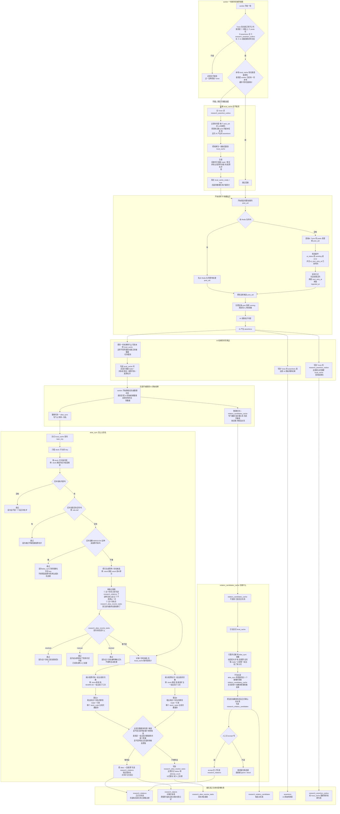

```mermaid
flowchart TB
      subgraph w["worker 一轮按时间顺序做事"]
          A["worker 开始一轮"] --> B{"Turso 现在能正常开工吗<br/>意思是 ① 能连上 ② posts 在
  ③ assertions 在 ④ research_assertion_outbox 在 ⑤ AI 调度要用的列也在"}
          B -- "不能" --> B1["这轮先不继续<br/>过一会再检查 Turso"]
          B -- "能" --> C{"本地 local_cache 现在能直接用吗<br/>意思是 worker 已经有一份本地
  缓存可供后面统计"}
      end

      subgraph rebuild["如果 local_cache 还不能用"]
          C -- "不能，常见于刚启动后" --> D["去 Turso 读 research_assertion_outbox"]
          D --> D1["这里存的是 每个 post_uid 的 AI 结果包<br/>里面有这条 post 的基本信息 和
  这次 AI 产出的 assertions"]
          D1 --> E["把结果包一条条回放到 local_cache"]
          E --> E1["注意<br/>回放时只保留 trade.* 断言<br/>并拆出 股票代码表 和 股票名字
  表"]
          E1 --> F["现在 local_cache_ready = true<br/>后面的整理任务才能用它"]
          C -- "能" --> G["跳过回放"]
      end

      subgraph ai["开始安排 AI 处理帖子"]
          F --> H["开始挑这轮要处理的 post_uid"]
          G --> H
          H --> I{"有 Redis 队列吗"}
          I -- "有" --> J["先从 Redis 队列拿待处理 post_uid"]
          I -- "没有" --> K["直接从 Turso 的 posts 表里挑 post_uid"]
          K --> K1["挑选条件<br/>ai_status 是 pending 或 error<br/>并且 ai_next_retry_at 已
  到时间"]
          K1 --> K2["排序方式<br/>先没处理过的<br/>再按 next_retry_at<br/>再按
  ingested_at"]
          J --> L["拿到这轮候选 post_uid"]
          K2 --> L
          L --> M["先把这条 post 改成 running<br/>抢到的人才继续做"]
          M --> N["AI 读取帖子内容"]
          N --> O["AI 产出 assertions"]
      end

      subgraph save["AI 结果同时写两边"]
          O --> P["写到 Turso 的 assertions 表<br/>这是 AI 原始判断结果"]
          O --> Q["写到 Turso 的 research_assertion_outbox<br/>这是给以后重建 local_cache
  用的结果包"]
          O --> R["把同一份结果再马上写到本地 local_cache<br/>这样不用等重启也能立刻被整理
  任务看到"]
          R --> R1["写进 local_cache 时<br/>还是只保留 trade.*<br/>并拆成 断言 / 股票代码 /
  股票名字"]
      end

      subgraph organize["后面开始整理 AI 原始结果"]
          R1 --> S["worker 开始跑低优先级整理任务<br/>意思是 把 AI 原始结果整理成更好用的关
  系数据"]
          S --> T["整理任务一 alias_sync<br/>专门认 简称 / 别名"]
          S --> U["整理任务二 relation_candidates_cache<br/>专门整理 现在像关系 但还不敢直
  接定案 的候选关系"]
      end

      subgraph alias["alias_sync 怎么认别名"]
          T --> V["先扫 local_cache 里的 topic_key"]
          V --> W["只保留 stock: 开头的 key"]
          W["只看 stock: 开头的 key"] --> X1["取 stock: 后半段内容<br/>例: stock:紫金的后半段是紫金"]
        X1 --> X2{"后半段有内容吗"}
        X2 -- "没有" --> X2a["跳过<br/>因为这不是一个真正的名字"]
        X2 -- "有" --> X3{"后半段里还有冒号吗<br/>例: abc:def"}
        X3 -- "有" --> X3a["跳过<br/>因为格式不像普通股票名字"]
        X3 -- "没有" --> X4{"后半段像 600519.SH 这种真股票代码吗"}
        X4 -- "像" --> X4a["跳过<br/>因为alias_sync只想找像名字的 key<br/>不想把真股票代码再当成别名处理"]
        X4 -- "不像" --> Y["把它当成简称 / 别名候选<br/>例: stock:紫金 stock:贵州茅台"]
        Y --> Y1["再跳过两类<br/>① 这个别名已经写进 research_relations 了<br/>说明已经认定过了 不
  用再认一次<br/>② 这个别名在 research_alias_resolve_tasks 里已经有最终处理结果了"]
  Y1 --> Y2{"research_alias_resolve_tasks 里的状态是什么"}
  Y2 -- "resolved" --> Y2a["跳过<br/>因为这个别名已经处理成功了"]
  Y2 -- "manual" --> Y2b["跳过<br/>因为自动判断试了很多次还不稳<br/>已经改成等人工处理"]
  Y2 -- "blocked" --> Y2c["跳过<br/>因为这个别名被明确标记为不要再自动处理"]
  Y2 -- "都不是" --> Z["继续做共现统计"]
          Y1 --> Z["对每个别名候选 去 local_cache 做共现统计"]
          Z --> Z1["统计股票代码一起出现的次数<br/>例: stock:紫金 和 601899.SH 一起出现了几次"]
          Z1 --> Z2["算法A<br/>看出现这个别名的那些 trade.* 行里<br/>哪个 stock_code 出现次
  数最多<br/>"]
          Z --> Z3["统计股票名字一起出现的次数<br/>例: stock:紫金 和 紫金矿业 一起出现了几次"]
          Z3 --> Z4["算法B<br/>看出现这个别名的那些 trade.* 行里<br/>哪个 stock_name 出现次
  数最多"]
          Z2 --> AA{"出现次数最多的那个候选<br/>是不是已经明显强于其他候选<br/>意思是 一起出现次数最多的那个答案<br/>是不是明显比后面其他候
  选更强"}
          Z4 --> AA
          AA -- "够明显" --> AB["把 alias -> 真股票 写进 research_relations<br/>到这里别名
  关系才正式成立"]
          AA -- "不够明显" --> AC["写到 research_alias_resolve_tasks<br/>这里会记 status 和
  attempt_count<br/>以后重试 或 人工处理"]
      end

      subgraph candidate["relation_candidates_cache 在做什么"]
          U --> AD["relation_candidates_cache 不是表 它是后台任务"]
  AD --> AE["它也会扫 local_cache"]
  AE --> AF["它看的证据 和 alias_sync 很像<br/>也是看 名字 和 真股票 在同一条 trade.* 记录里一起出现了多少次"]
  AF --> AF1["不同点是<br/>alias_sync 想直接找出 1 个最像的答案<br/>relation_candidates_cache 会先把多个高概率答案收集起来"]
  AF1 --> AG["把这些高概率但还没正式确认的关系<br/>写进 research_relation_candidates"]
          AG --> AH{"人工点 accept 吗"}
          AH -- "是" --> AI["accept 后 才写进 research_relations"]
          AH -- "不是" --> AJ["继续留在候选表<br/>或者被 ignore / block"]
      end

      subgraph final["最后真正生效的是哪些表"]
          AB --> AK["research_relations<br/>正式关系表<br/>页面和后续任务主要看这里"]
          AI --> AK
          AB --> AL["research_objects<br/>对象目录表<br/>把股票 板块这些对象也登记好"]
          AC --> AM["research_alias_resolve_tasks<br/>别名待处理表"]
          AG --> AN["research_relation_candidates<br/>候选关系表"]
          P --> AO["assertions<br/>AI 原始判断表"]
          Q --> AP["research_assertion_outbox<br/>给 local_cache 重建用的结果包表"]
      end
```