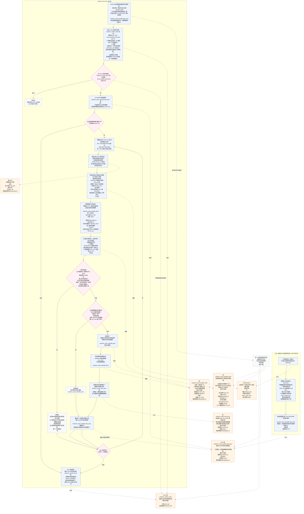

```mermaid
flowchart TB
      classDef task fill:#eef4ff,stroke:#3b5bdb,color:#111,stroke-width:1px;
      classDef table fill:#fff4e6,stroke:#e67700,color:#111,stroke-width:1px;
      classDef decision fill:#fff0f6,stroke:#c2255c,color:#111,stroke-width:1px;
      classDef note fill:#f8f9fa,stroke:#868e96,color:#111,stroke-dasharray: 4 2;

      start["worker 后台线程轮到做低优先级任务了<br/>现在开始一轮补找帖子任务
  backfill_cache<br/>它不会把所有股票都重查一遍<br/>而是先去看 Turso 的 backfill 待办股票表
  research_stock_backfill_dirty_keys<br/>找出哪些股票被标成『需要重新补找帖子』"]:::task
      schemaNote["第一次用这些表的时候<br/>如果表还不存在<br/>代码会先把表建好<br/>然后再继
  续往下做"]:::note

      subgraph upstream["上游：哪些地方会把股票放进 backfill 待办里"]
          up1["AI 刚处理完一条帖子<br/>先把正式结果写进断言表 assertions"]:::task
          up2["再看这次写进去的 assertions<br/>把里面提到的股票挑出来<br/>① 如果主题标识
  topic_key 本身就是 stock:开头<br/>就记下这只股票<br/>② 如果股票代码列表 stock_codes_json
  里还有股票代码<br/>也把那些股票记下来"]:::task
          up3["把这些股票写进 Turso 的 backfill 待办股票表
  research_stock_backfill_dirty_keys<br/>意思是：这些股票原来的补找结果可能旧了<br/>后面要
  重新补找一次"]:::task
          up1 --> up2 --> up3
      end

      subgraph main["backfill_cache 这一轮主线"]
          lockTry["先去 Turso 的任务锁表 research_worker_locks 抢锁<br/>看锁名 lock_key =
  stock_backfill_cache.lock 这一行<br/>① 如果还没有这一行 就新建一行 说明抢到了<br/>② 如果
  已经有这一行 但锁过期时间 locked_until 已经过了<br/>就改成新的过期时间 说明抢到了<br/>③
  如果锁还没过期<br/>就说明别的 worker 还在做 这一轮直接跳过"]:::task
          lockOk{"在 Turso 的任务锁表 research_worker_locks 里<br/>这把锁
  stock_backfill_cache.lock<br/>抢到了吗"}:::decision
          skipRound["没抢到<br/>说明别的 worker 正在做<br/>这一轮就先不做了"]:::note

          pickDirty["从 backfill 待办股票表 research_stock_backfill_dirty_keys 里<br/>拿一
  小批最早进入待办的股票<br/>也就是待重算的股票标识 stock_key"]:::task
          hasDirty{"这次拿到要处理的股票了吗<br/>字段名是 stock_key"}:::decision

          makeTerms["把股票标识 stock_key 变成拿来搜帖子的词<br/>例：stock:600519.SH 会变成
  600519.SH 和 600519<br/>例：stock:紫金 会变成 紫金"]:::task

          scanPosts["去帖子表 posts 里找帖子<br/>只看已经处理过的帖子<br/>也就是处理完成时
  间 processed_at 不是空<br/>再从新到旧去看帖子文字里有没有这些词"]:::task

          filterFormal["先把已经正式算到这只股票名下的帖子排掉<br/>做法是去断言表
  assertions 里按帖子编号 post_uid 看<br/>如果同一条帖子已经满足<br/>主题标识 topic_key =
  这只股票<br/>而且动作类型 action 是 trade.开头<br/>那这条帖子这次就跳过 不再放进
  backfill"]:::task

          buildRows["把刚刚留下来的帖子<br/>整理成一行一条的标准结果<br/>准备写进补找结果表
  research_stock_backfill_posts<br/>每一行会带上<br/>帖子编号 post_uid<br/>作者 author<br/>
  发帖时间 created_at<br/>帖子地址 url<br/>命中的搜索词 matched_terms<br/>给人看的短摘要
  preview<br/>还有这条帖子的上下文整理文本 tree_text"]:::task

          readMeta["去看这只股票上一次保存的 backfill 结果<br/>主要看两样东西<br/>① 结果指
  纹 signature 也就是用来判断结果有没有变的一串标记<br/>② 结果条数 row_count 也就是上次一共
  有几条"]:::task

          keepOldQ{"代码会先看<br/>这只股票这一轮最多只扫 20 批<br/>每批最多 200 条<br/>如
  果上限已经用完了<br/>但还不是已经查到结尾<br/>就按『这次还没查全』处理<br/>并且这只股票以
  前已经有旧结果了吗"}:::decision
          keepOld["如果是<br/>说明这次新查到的结果可能还不完整<br/>先不要拿这份不完整的新结
  果覆盖旧结果<br/>旧结果先留着<br/>这只股票也继续留在待办表里<br/>等下一轮再继续
  查"]:::note

          sameQ{"这次新整理出来的结果<br/>和上次保存的结果<br/>看起来一样吗<br/>也就是结果
  指纹 signature 和结果条数 row_count 都一样吗"}:::decision
          noWrite["如果没变<br/>就不重写补找结果表 research_stock_backfill_posts"]:::note

          writeBackfill["如果变了<br/>就把这只股票这次的新结果<br/>整批写进补找结果表
  research_stock_backfill_posts<br/>把旧的换掉"]:::task
          writeMeta["然后把新的结果指纹 signature 和结果条数 row_count<br/>写回结果摘要表
  research_stock_backfill_meta"]:::task
          markDirty["如果这次补找结果变了<br/>就把这只股票记到 research_stock_dirty_keys 里<br/>意思是：通知后面的任务<br/>这只股票的页面数据要重新做"]:::task

          removeKey["通常这一只股票处理完以后<br/>就从 backfill 待办股票表
  research_stock_backfill_dirty_keys 里删掉它<br/>意思是这只股票这轮已经做完了"]:::task
          moreKey{"这一批待办里<br/>还有下一只股票吗"}:::decision
          releaseLock["这一轮结束后<br/>回到 Turso 的任务锁表 research_worker_locks<br/>把
  这把锁的锁过期时间 locked_until 改成 0<br/>意思是这把锁放开了<br/>别的 worker 现在可以来
  抢"]:::task

          start --> lockTry --> lockOk
          lockOk -- "没有" --> skipRound
          lockOk -- "有" --> pickDirty --> hasDirty
          hasDirty -- "没有" --> releaseLock
          hasDirty -- "有" --> makeTerms --> scanPosts --> filterFormal --> buildRows -->
  readMeta --> keepOldQ
          keepOldQ -- "是" --> keepOld --> moreKey
          keepOldQ -- "不是" --> sameQ
          sameQ -- "是" --> noWrite --> removeKey --> moreKey
          sameQ -- "不是" --> writeBackfill --> writeMeta --> markDirty --> removeKey -->
  moreKey
          moreKey -- "有" --> makeTerms
          moreKey -- "没有" --> releaseLock
      end

      assertions["表 assertions<br/>这里放 AI 已经正式写下来的判断结果<br/>里面会有<br/>主
  题标识 topic_key<br/>股票代码列表 stock_codes_json<br/>动作类型 action"]:::table
      dirtyKeys["Turso 表 research_stock_backfill_dirty_keys<br/>这是 backfill 的待办股票表
  <br/>一行就是一只后面要重新补找的股票<br/>重点字段是<br/>股票标识 stock_key<br/>进入待办
  的原因 reason<br/>最后更新时间 updated_at"]:::table
      locks["Turso 表 research_worker_locks<br/>这是后台任务抢锁用的表<br/>重点字段是<br/>
  锁名 lock_key<br/>锁过期时间 locked_until"]:::table
      posts["表 posts<br/>这里放帖子内容<br/>比如<br/>帖子原文 raw_text<br/>展示文字
  display_md<br/>处理完成时间 processed_at"]:::table
      meta["表 research_stock_backfill_meta<br/>这里一只股票一行<br/>记的是这只股票上次
  backfill 结果的摘要<br/>重点字段是<br/>股票标识 stock_key<br/>结果指纹 signature<br/>结果
  条数 row_count<br/>最后更新时间 updated_at"]:::table
      backfillPosts["表 research_stock_backfill_posts<br/>这里放的是这只股票的补找结果<br/>
  也就是文本里提到了它<br/>但还没有在 assertions 里正式挂到它名下的帖子<br/>常见字段有<br/>
  帖子编号 post_uid<br/>作者 author<br/>发帖时间 created_at<br/>帖子地址 url<br/>命中的搜索
  词 matched_terms<br/>短摘要 preview<br/>上下文整理文本 tree_text"]:::table
      stockDirty["表 research_stock_dirty_keys<br/>这是给 stock_hot_cache 用的待办表<br/>哪只股票的页面缓存要重做<br/>就先把哪只股票记在这里<br/>重点字段是<br/>股票标识 stock_key<br/>原因 reason<br/>最后更新时间 updated_at"]:::table
      start -.首次运行时会建表.-> schemaNote
      schemaNote -.-> locks
      schemaNote -.-> dirtyKeys
      schemaNote -.-> meta
      schemaNote -.-> backfillPosts

      up1 -.写入.-> assertions
      up3 -.写入.-> dirtyKeys

      lockTry -.读写.-> locks
      lockOk -.判断依据就在这张表.-> locks
      pickDirty -.读取.-> dirtyKeys
      scanPosts -.读取.-> posts
      filterFormal -.读取.-> assertions
      readMeta -.读取.-> meta
      writeBackfill -.重写.-> backfillPosts
      writeMeta -.更新.-> meta
      removeKey -.删除已做完的股票.-> dirtyKeys
      markDirty -.写入.-> stockDirty
      releaseLock -.写回.-> locks
```
