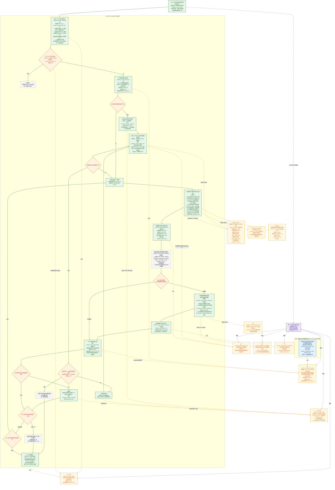

```mermaid
flowchart TB
      %% ========== 版块颜色定义 ==========
      classDef upstream fill:#e3f2fd,stroke:#1565c0,color:#0d3c6e,stroke-width:2px;
      classDef mainTask fill:#e8f5e9,stroke:#2e7d32,color:#1b5e20,stroke-width:2px;
      classDef mainDecision fill:#fff3e0,stroke:#e65100,color:#bf360c,stroke-width:2px;
      classDef mainNote fill:#f5f5f5,stroke:#616161,color:#212121,stroke-width:1px,stroke-dasharray: 4 2;
      classDef dataTable fill:#fff8e1,stroke:#f9a825,color:#e65100,stroke-width:2px;
      classDef schemaTable fill:#ede7f6,stroke:#5e35b1,color:#311b92,stroke-width:2px;

      %% ========== 节点定义与分类 ==========
      start["worker 后台线程轮到做低优先级任务了<br/>现在开始一轮股票热点缓存任务 stock_hot_cache<br/>它的目标是：把某只股票的页面缓存重新做一遍"]:::mainTask
      schemaNote["第一次用这些表的时候<br/>如果表还不存在<br/>代码会先把表建好<br/>然后再继续往下做"]:::schemaTable

      subgraph upstream["上游：哪些地方会把股票放进 stock_hot_cache 待办里"]
          up1["别的任务如果发现某只股票的页面缓存要更新<br/>就会把这只股票写进 research_stock_dirty_keys<br/>常见来源有<br/>alias_sync<br/>relation_candidates_cache<br/>backfill_cache<br/>还有人工处理候选关系"]:::upstream
      end

      subgraph main["stock_hot_cache 这一轮主线"]
          lockTry["先去 Turso 的任务锁表 research_worker_locks 抢锁<br/>看锁名 lock_key = stock_hot_cache.lock 这一行<br/>一 如果还没有这一行 就新建一行 说明抢到了<br/>二 如果已经有这一行 但锁过期时间 locked_until 已经过了<br/>就改成新的过期时间 说明抢到了<br/>三 如果锁还没过期<br/>就说明别的 worker 还在做 这一轮直接跳过"]:::mainTask
          lockOk{"在 Turso 的任务锁表 research_worker_locks 里<br/>这把锁 stock_hot_cache.lock<br/>抢到了吗"}:::mainDecision
          skipRound["没抢到<br/>说明别的 worker 正在做<br/>这一轮就先不做了"]:::mainNote

          loadDirty["先去股票刷新待办表 research_stock_dirty_keys 里<br/>拿一小批待刷新的股票<br/>默认这一轮最多处理 4 只<br/>每条会带上<br/>股票标识 stock_key<br/>原因 reason<br/>最后更新时间 updated_at"]:::mainTask
          hasDirty{"这次拿到待刷新的股票了吗"}:::mainDecision

          loadCursor["如果待办表里没有股票<br/>就进入『补漏模式』<br/>先去 research_worker_state 里读 bootstrap_cursor<br/>它的意思就是：上次补漏停在了哪只股票"]:::mainTask

          bootstrapPick["再去 assertions 里补找漏掉的股票<br/>条件是：已经有正式 trade 类断言<br/>但在 research_stock_signals_hot 里还没有热点缓存<br/>如果 bootstrap_cursor 有值<br/>就从上次停下来的地方后面继续找<br/>默认这一轮最多补 4只"]:::mainTask

          hasBootstrapKeys{"补漏模式这次找到股票了吗"}:::mainDecision
          resetCursorQ{"如果这次一个漏补股票都没找到<br/>系统里还记着『上次停下来的地方』吗"}:::mainDecision
          resetCursor["如果还记着<br/>就把这个旧位置清掉<br/>然后从头再找一遍漏补股票"]:::mainTask

          noWork["如果正常待办和补漏模式都没有股票可做<br/>这一轮直接结束"]:::mainNote

          perStock["开始处理这一只股票<br/>先拿到股票标识 stock_key<br/>再看它为什么进入待办 reason"]:::mainTask

          buildHot["先重做这只股票的热点主数据<br/>做法是<br/>一 去 research_relations 里找这只股票的正式别名关系<br/>二 去 assertions 里找最近 30 天和这只股票有关的 trade 类断言<br/>三 也会把别名命中的断言<br/>和 stock_codes_json 里带这个代码的断言一起算进来<br/>四 再根据这些断言里的 cluster_keys 统计相关板块<br/>五 最后去 posts 里补齐原文 链接 作者 时间 和上下文"]:::mainTask

          saveHot["把整理好的热点结果写进 research_stock_signals_hot<br/>里面会存<br/>实体股票 entity_key<br/>标题 header_title<br/>信号总数 signal_total<br/>信号列表 signals_json<br/>相关板块 related_sectors_json"]:::mainTask

          extrasRule["接着判断要不要重做附加快照 research_stock_extras_snapshot<br/>规则是<br/>一 如果 reason 是 alias_relation candidate_action queue_backfill relation_candidates_cache backfill_cache 之一<br/>就强制重做<br/>二 否则只有旧快照超过 900 秒<br/>才重做"]:::mainNote
          extrasQ{"按上面的规则看<br/>这次要重做附加快照吗"}:::mainDecision

          buildExtras["如果要重做附加快照<br/>就去两张表拿数据<br/>原因是research_stock_extras_snapshot 这张表<br/>本来就只存两类补充信息<br/>一 这只股票还没最后定下来的候选关系<br/>从 research_relation_candidates 里拿 pending 的<br/>二 这只股票补找出来的相关帖子<br/>从 research_stock_backfill_posts 里拿"]:::mainTask

          saveExtras["把这两类补充信息写进 research_stock_extras_snapshot<br/>一块写到pending_candidates_json<br/>一块写到 backfill_posts_json<br/>这样后面读这一张表就够了"]:::mainTask

          removeDirty["这一只股票做完以后<br/>就从 research_stock_dirty_keys 里删掉它<br/>如果最后规范化出来的实体股票 entity_key<br/>和原来的 stock_key 不一样<br/>也会把实体股票那条待办一起删掉"]:::mainTask

          saveCursorQ{"这只股票是不是补漏模式找到的"}:::mainDecision
          saveCursor["如果是<br/>就把这只股票记成新的『上次停下来的地方』<br/>写回 research_worker_state 里的 bootstrap_cursor"]:::mainTask

          yieldQ{"这一轮现在还适合继续做下一只吗"}:::mainDecision
          yieldStop["如果这时候前面的 RSS 或 AI 更忙了<br/>这里就先停一下<br/>剩下的股票留给下一轮"]:::mainNote

          moreKey{"这一轮手里的股票还没做完吗"}:::mainDecision
          releaseLock["这一轮结束后<br/>回到 Turso 的任务锁表 research_worker_locks<br/>把这把锁的锁过期时间 locked_until 改成 0<br/>意思是这把锁放开了<br/>别的 worker 现在可以来抢"]:::mainTask
      end

      %% ========== 外部数据表节点 ==========
      workerLocks["Turso 表 research_worker_locks<br/>这是后台任务抢锁用的表<br/>重点字段是<br/>锁名 lock_key<br/>锁过期时间 locked_until"]:::dataTable
      workerState["Turso 表 research_worker_state<br/>这里会记一些后台任务进度<br/>stock_hot_cache 在这里记 bootstrap_cursor<br/>它的意思就是<br/>上次补漏停在了哪只股票"]:::dataTable
      stockDirty["表 research_stock_dirty_keys<br/>这是给 stock_hot_cache 用的待办表<br/>哪只股票的页面缓存要重做<br/>就先把哪只股票记在这里<br/>重点字段是<br/>股票标识 stock_key<br/>原因 reason<br/>最后更新时间 updated_at"]:::dataTable
      assertions["表 assertions<br/>这里放 AI 已经正式写下来的断言<br/>stock_hot_cache 主要会读<br/>主题标识 topic_key<br/>动作类型 action<br/>摘要 summary<br/>股票代码列表 stock_codes_json<br/>股票名称列表 stock_names_json<br/>板块键列表 cluster_keys_json"]:::dataTable
      relations["表 research_relations<br/>这里放正式关系<br/>stock_hot_cache 主要用它找股票正式别名<br/>这样别名相关的断言也能一起算进来"]:::dataTable
      posts["表 posts<br/>这里放帖子原文和展示内容<br/>stock_hot_cache 会从这里补齐<br/>原文 raw_text<br/>展示文字 display_md<br/>作者 author<br/>时间 created_at<br/>地址 url"]:::dataTable
      stockHot["表 research_stock_signals_hot<br/>这是股票热点主结果表<br/>一只股票一行<br/>里面会放这只股票整理好的热点信号"]:::dataTable
      relationCandidates["表 research_relation_candidates<br/>这里放还没最后定下来的候选关系<br/>stock_hot_cache 会把 pending 的候选带进附加快照"]:::dataTable
      backfillPosts["表 research_stock_backfill_posts<br/>这里放 backfill_cache 补找出来的帖子<br/>stock_hot_cache 会把这些帖子带进附加快照"]:::dataTable
      stockExtras["表 research_stock_extras_snapshot<br/>这是股票附加快照表<br/>里面会放<br/>pending_candidates_json<br/>backfill_posts_json"]:::dataTable

      %% ========== 连线（保持原逻辑） ==========
      start --> lockTry --> lockOk
      lockOk -- "没有" --> skipRound
      lockOk -- "有" --> loadDirty --> hasDirty
      hasDirty -- "有" --> perStock
      hasDirty -- "没有" --> loadCursor --> bootstrapPick --> hasBootstrapKeys
      hasBootstrapKeys -- "有" --> perStock
      hasBootstrapKeys -- "没有" --> resetCursorQ
      resetCursorQ -- "是" --> resetCursor --> bootstrapPick
      resetCursorQ -- "不是" --> noWork --> releaseLock

      perStock --> buildHot --> saveHot --> extrasRule --> extrasQ
      extrasQ -- "要重做" --> buildExtras --> saveExtras --> removeDirty
      extrasQ -- "不用重做" --> removeDirty

      removeDirty --> saveCursorQ
      saveCursorQ -- "是" --> saveCursor --> yieldQ
      saveCursorQ -- "不是" --> yieldQ

      yieldQ -- "先停一下" --> yieldStop --> releaseLock
      yieldQ -- "还能继续" --> moreKey
      moreKey -- "还有" --> perStock
      moreKey -- "没有" --> releaseLock

      %% ========== 数据流（虚线） ==========
      start -.->|首次运行时会建表| schemaNote
      schemaNote -.->|建表| workerLocks
      schemaNote -.->|建表| workerState
      schemaNote -.->|建表| stockDirty
      schemaNote -.->|建表| stockHot
      schemaNote -.->|建表| stockExtras
      schemaNote -.->|建表| relationCandidates

      up1 -.->|写入| stockDirty

      lockTry -.->|读写| workerLocks
      lockOk -.->|判断依据就在这张表| workerLocks

      loadDirty -.->|读取| stockDirty
      loadCursor -.->|读取上次停下来的位置| workerState
      bootstrapPick -.->|读取正式断言| assertions
      bootstrapPick -.->|检查哪些股票还没有热点缓存| stockHot
      resetCursor -.->|清掉旧位置| workerState

      buildHot -.->|读取正式别名| relations
      buildHot -.->|读取近期 trade 类断言| assertions
      buildHot -.->|读取帖子正文和上下文| posts
      saveHot -.->|写入| stockHot

      buildExtras -.->|读取 pending 候选| relationCandidates
      buildExtras -.->|读取补找帖子| backfillPosts
      saveExtras -.->|写入| stockExtras

      removeDirty -.->|删除已做完的股票| stockDirty
      saveCursor -.->|写回新的停下位置| workerState
      releaseLock -.->|写回| workerLocks

      %% ========== 连线颜色配置（按版块区分） ==========
      %% 主线内部控制流（实线）: 深绿色
      linkStyle 0,1,2,3,4,5,6,7,8,9,10,11,12,13,14,15,16,17,18,19,20,21,22,23,24,25,26,27,28,29,30,31 stroke:#2e7d32,stroke-width:2px;
      %% 上游虚线（up1 -> stockDirty）: 蓝色
      linkStyle 32 stroke:#1565c0,stroke-width:2px;
      %% 建表相关虚线（start -> schemaNote 及各表）: 紫色
      linkStyle 33,34,35,36,37,38,39 stroke:#5e35b1,stroke-width:2px;
      %% 主线与数据表交互虚线: 橙色
      linkStyle 40,41,42,43,44,45,46,47,48,49,50,51,52,53,54,55,56 stroke:#f57c00,stroke-width:2px;
```
